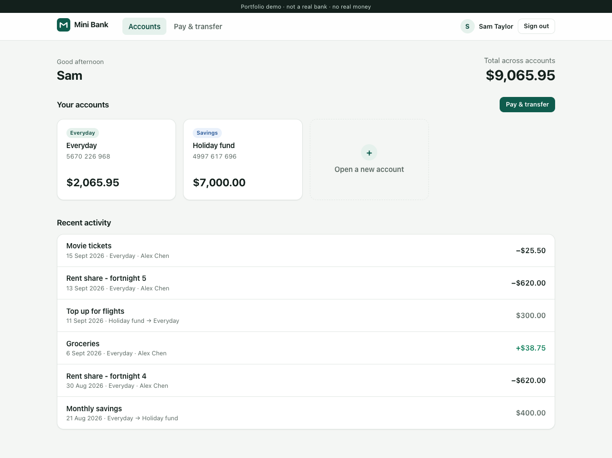
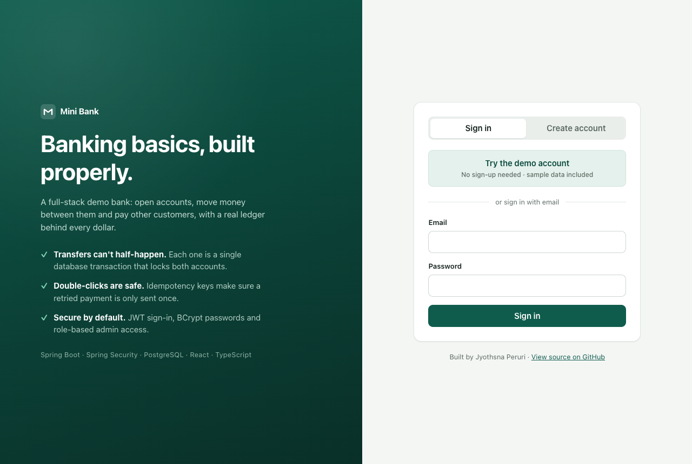
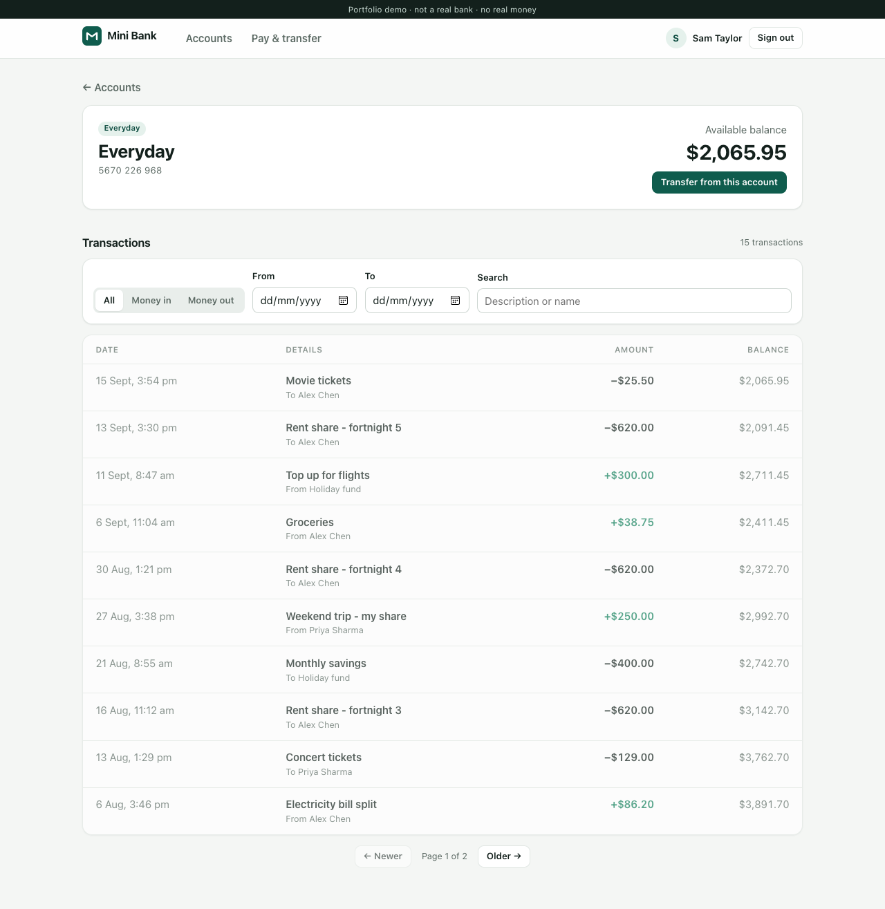
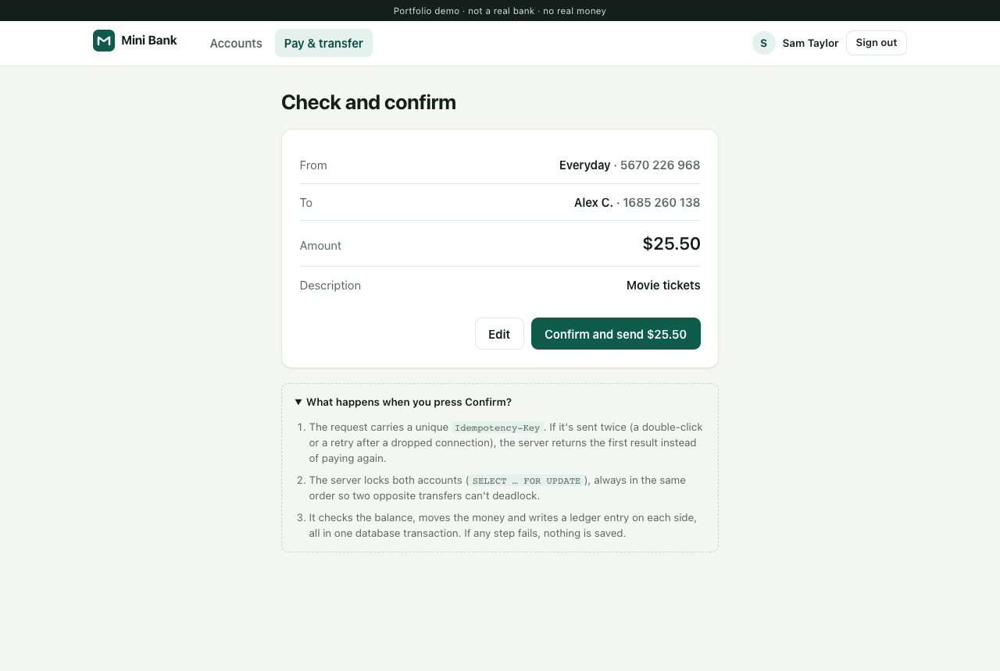
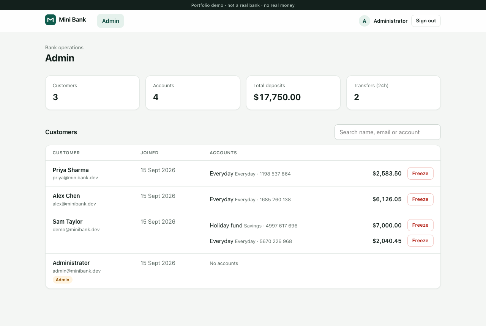
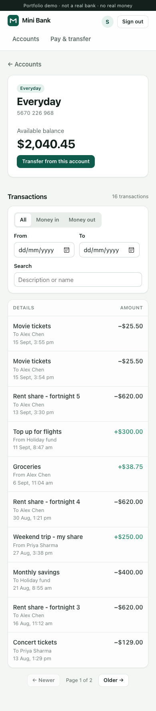

# Mini Bank

A full-stack demo banking app: customers open accounts, move money between them and pay other customers, and an admin can freeze accounts. Every balance change goes through a proper ledger, and transfers are safe against double-clicks and concurrent requests.

**Live demo:** _coming soon_ · click **Try the demo account** to sign in with sample data, no sign-up needed.

> This is a portfolio project, not a real bank. No real money is involved.



## Tech stack

| Layer | Technology |
| --- | --- |
| Backend | Java 21, Spring Boot 4, Spring Security (JWT resource server), Spring Data JPA / Hibernate, Bean Validation |
| Database | PostgreSQL, schema managed with Flyway migrations |
| Frontend | React 19, TypeScript, React Router, Vite |
| Testing | JUnit 5 + MockMvc integration tests against a real PostgreSQL database |
| CI/CD | GitHub Actions (tests + lint + build on every push) |
| Hosting | Render (API, Docker), Neon (PostgreSQL), Vercel (frontend) - all free tiers |

## Features

- **Sign up / sign in** with JWT authentication and BCrypt-hashed passwords. New customers get an Everyday account with $1,000 of demo money.
- **Accounts:** open up to four Everyday or Savings accounts, each with a unique 10-digit account number.
- **Transfers** between your own accounts, or to another customer by account number, with a review step before sending.
- **Payee confirmation:** typing an account number shows the masked holder name ("Alex C.") before you pay, and recent payees are one click away.
- **Transaction history** with filters for money in/out, date range and text search, plus server-side pagination.
- **Admin console** (role-based): bank-wide stats, all customers and their accounts, and freezing/unfreezing an account.
- **Responsive UI** that works on phones, with a "waking up the server" notice for free-tier cold starts.

## Engineering highlights

These are the parts I'd walk through in an interview.

### 1. Transfers are atomic and can't overdraw

[`TransferService.postTransfer`](backend/src/main/java/dev/jyothsna/minibank/transfer/TransferService.java) runs in a single database transaction:

1. Locks both account rows with `SELECT ... FOR UPDATE`.
2. Checks ownership, account status and available balance *after* taking the locks, so the balance it checks can't change underneath it.
3. Debits one account, credits the other, and writes a ledger entry on each side.

If any step fails, the whole transaction rolls back. A `CHECK (balance >= 0)` constraint in the schema is a final safety net.

The test `concurrentTransfersNeverOverdrawTheAccount` fires 10 transfers of $150 at the same instant from an account holding $1,000. Exactly 6 succeed and the balance ends at $100.00, never negative.

### 2. Deadlock-free locking

Two opposite transfers (A→B and B→A) at the same time could deadlock if each locks its own "from" account first. The service always locks the two accounts **in id order**, whichever direction the money moves.

### 3. Idempotent payments

Every transfer request carries an `Idempotency-Key` header, which the frontend generates once per payment attempt. The database has a unique constraint on `(user, idempotency_key)`, so:

- A double-click or a retry after a dropped connection returns the **original** transfer (`200` + `Idempotent-Replayed: true`) instead of paying twice.
- If two identical requests race, the unique constraint lets exactly one commit, and the loser returns the winner's result.
- Reusing a key for a *different* payment is rejected with `409`.

### 4. A real ledger

Balances are never changed silently. Every movement writes an append-only `ledger_entries` row with a signed amount and the resulting `balance_after`, which is what the statement screen shows.

### 5. Security

- Stateless JWT (HS256) auth using Spring Security's OAuth2 resource server. The signing key comes from an environment variable and is never committed.
- Role-based access: `/api/admin/**` requires `ADMIN`. The admin user is created from environment variables at startup.
- Another customer's account id returns `404`, not `403`, so account ids can't be probed.
- Login gives the same error for a wrong email or a wrong password.
- All errors use RFC 9457 `problem+json` with a stable `code` field, and validation errors list each invalid field.

## Screenshots

| Sign in | Transaction history |
| --- | --- |
|  |  |
| **Review before sending** | **Admin console** |
|  |  |



## API overview

| Method | Endpoint | Description |
| --- | --- | --- |
| `POST` | `/api/auth/register` | Create a customer and their first account |
| `POST` | `/api/auth/login` | Get a JWT |
| `GET` | `/api/me` | Current user |
| `GET` | `/api/accounts` | My accounts |
| `POST` | `/api/accounts` | Open a new account |
| `GET` | `/api/accounts/{id}/transactions` | History (`direction`, `from`, `to`, `q`, `page`, `size`) |
| `GET` | `/api/accounts/lookup?number=` | Confirm a payee's (masked) name |
| `POST` | `/api/transfers` | Send money (requires `Idempotency-Key` header) |
| `GET` | `/api/transfers/recent-payees` | People I've paid recently |
| `GET` | `/api/admin/stats` | Bank-wide totals (admin) |
| `GET` | `/api/admin/customers` | All customers and accounts (admin) |
| `PATCH` | `/api/admin/accounts/{id}` | Freeze / unfreeze an account (admin) |

## Project structure

```
backend/                     Spring Boot API
  src/main/java/.../
    auth/                    register, login, JWT issuing
    account/                 accounts, ledger, history search
    transfer/                money movement + idempotency
    admin/                   admin endpoints
    config/                  security, JWT, CORS
    seed/                    demo data + admin user
  src/main/resources/db/migration/   Flyway SQL migrations
  src/test/                  integration tests (real PostgreSQL)
frontend/                    React + TypeScript (Vite)
  src/pages/                 Login, Dashboard, Account, Transfer, Admin
.github/workflows/ci.yml     CI pipeline
render.yaml                  Render deployment blueprint
```

## Running locally

**Prerequisites:** Java 21, Node 20+, and PostgreSQL running locally.

```bash
# 1. Databases
createdb minibank
createdb minibank_test

# 2. Backend (http://localhost:8080) - creates the schema and the demo data on first start
cd backend
./mvnw spring-boot:run

# 3. Frontend (http://localhost:5173) - in another terminal
cd frontend
npm install
npm run dev
```

Open http://localhost:5173 and click **Try the demo account** (`demo@minibank.dev` / `Demo@1234`).

To also create an admin user, start the backend with `ADMIN_EMAIL=you@example.com ADMIN_PASSWORD=choose-one ./mvnw spring-boot:run`.

The backend connects to `localhost:5432` as your OS user by default. Override it with `DB_URL`, `DB_USERNAME` and `DB_PASSWORD`.

### Tests

```bash
cd backend && ./mvnw test        # 19 integration tests against the minibank_test database
cd frontend && npm run lint && npm run build
```

## Configuration

| Variable | Purpose | Default |
| --- | --- | --- |
| `DB_URL`, `DB_USERNAME`, `DB_PASSWORD` | PostgreSQL connection | local database |
| `JWT_SECRET` | HS256 signing key, 32+ characters | random per run (dev only) |
| `CORS_ORIGINS` | Allowed frontend origins, comma-separated | `http://localhost:5173` |
| `ADMIN_EMAIL`, `ADMIN_PASSWORD` | Creates the admin user at startup | none |
| `DEMO_ENABLED` | Seed the demo customer and history | `true` |
| `VITE_API_URL` (frontend) | Deployed API URL | proxied to `:8080` in dev |

## Trade-offs and next steps

- **Token storage:** the JWT is kept in `localStorage` for simplicity. A production bank would use short-lived tokens in `HttpOnly` cookies with refresh tokens.
- **Rate limiting** on login and payee lookup (e.g. Bucket4j) would stop credential stuffing and account-number enumeration.
- **Daily transfer limits** and an audit log for admin actions.
- **Scheduled transfers** and CSV statement export.

---

Built by **Jyothsna Peruri** · [LinkedIn](https://www.linkedin.com/in/jyothsna-jo-peruri/) · [Portfolio](https://jyothsnaperuri.github.io/Jyothsna-portfolio/)
